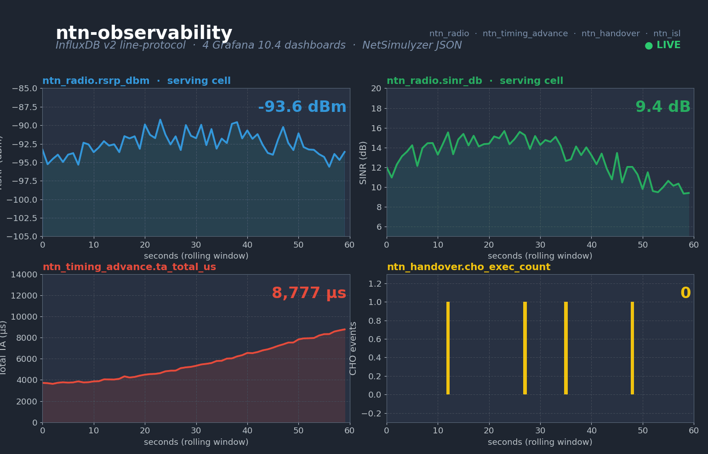

<h1 align="center">ntn-observability</h1>

<p align="center"><strong>InfluxDB Sinks, NetSimulyzer Exporter and Pre-Built Grafana Dashboards for 6G NTN Simulation</strong></p>

<p align="center">
  <a href="https://www.nsnam.org"></a>
  <a href="https://www.gnu.org/licenses/old-licenses/gpl-2.0.en.html"></a>
  
  
  
  
</p>

---

<p align="center">
  
</p>

## Why this module

A 6G NTN simulation produces every kind of telemetry that a real RAN does — RSRP, SINR, BLER, MCS, timing-advance, sat ECEF, ISL load, handover counters — but ns-3's default trace surface stops at flat ASCII files. That's fine for unit tests; it does not scale to a multi-hour, multi-satellite scenario where reviewers want to see what happened in a dashboard rather than reconstruct it from `.tr` files. `ntn-observability` plugs the simulator into the same observability stack production RANs already use: line-protocol into InfluxDB v2 over UDP or file, and a streaming NetSimulyzer JSON exporter for 3D playback. A canonical metric schema (`ntn-metric-schema.h`) names every KPI exactly once so downstream dashboards never break when new modules add metrics.

## At a glance

| Metric (1800 s scenario, full toolkit) | Value |
|---|---|
| Line-protocol file size | **1.95 MB** (18 810 points) |
| InfluxDB measurements | **6** (`ntn_radio` · `ntn_timing_advance` · `ntn_sat_pos` · `ntn_drx` · `ntn_sib19` · `ntn_ue_report`) |
| Grafana dashboards shipped | **4** (Overview · Handover · Radio · ISL) |
| Per-second cadence (`ntn_radio`, `ntn_timing_advance`, `ntn_sat_pos`, `ntn_drx`) | exactly **1800 / 1800** points |
| 160 ms cadence (`ntn_sib19`) | exactly **11 250 / 11 250** points |
| 5 s cadence (`ntn_ue_report`) | exactly **360 / 360** points |
| TA fidelity vs analytic ground truth | **mean &#124;err&#124; 0.49 µs, max 1.0 µs** (`int µs` truncation only) |
| NetSimulyzer JSON | 2 nodes + 2 series + 5 759 events |

## What it does

```
ns-3 traces  ─┐
              ├──► NtnInfluxSink ──► InfluxDB v2 ──► Grafana (4 dashboards)
              │     (UDP-line-protocol or file mode)
              │
              └──► NtnNetSimulyzerExporter ──► NetSimulyzer 3D viewer
                    (JSON 1.0 schema)
```

- **Canonical metric schema** (`model/ntn-metric-schema.h`) — header-only enum-string table that names every measurement, tag and field exactly once. A pinned `MetricSchemaStableTest` unit test catches accidental renames before they break shipped dashboards.
- **InfluxDB sink** — line-protocol encoder (with proper escape handling for commas, spaces and equals in tag/measurement keys), buffered file or UDP transport, and run-id tagging so multi-run dashboards can demux.
- **NetSimulyzer exporter** — streaming JSON writer compatible with the NIST NetSimulyzer 1.0 schema. Produces `configuration` / `nodes` / `series` / `events` sections in valid order, escapes inner quotes correctly.
- **Helper façade** (`NtnObservabilityHelper`) — one-call setup of both sinks with consistent run-id tagging.
- **Docker stack** — fully-provisioned InfluxDB 2.7 + Grafana 10.4 + Telegraf-sidecar (line-protocol UDP terminator with simulation-time → ingest-time rewrite, so points always land inside the InfluxDB retention window).
- **4 pre-built Grafana dashboards** — auto-loaded under the `ns3-ntn-toolkit` folder when the Docker stack starts.

## Install & run

File mode — no Docker:

```bash
git clone https://github.com/Muhammaduazir69/ntn-observability.git contrib/ntn-observability
./ns3 build ntn-observability-demo
build/contrib/ntn-observability/examples/ns3.43-ntn-observability-demo-default \
    --simTime=300 --runId=local-1 \
    --influxFile=/tmp/run.lp \
    --netSim=/tmp/run.json
```

Outputs: `/tmp/run.lp` (later `influx write -f /tmp/run.lp`) and `/tmp/run.json` (open in NetSimulyzer for 3D playback with timeline).

Grafana stack — Docker:

```bash
cd contrib/ntn-observability/docker
docker compose up -d
# Wait ~5 s for InfluxDB to finish first-run setup.

build/contrib/ntn-observability/examples/ns3.43-ntn-observability-demo-default \
    --simTime=600 --runId=docker-1 \
    --udpHost=127.0.0.1 --udpPort=8089 \
    --netSim=/tmp/docker-1.json
```

Open Grafana at http://localhost:3000 (admin / admin) — the 4 NTN dashboards are pre-loaded.

| Dashboard | Panels | Use it for |
|---|---|---|
| `NTN Overview` | TA, RSRP/SINR, sat ECEF | quick scenario sanity check |
| `NTN Handover` | CHO trigger / exec / fail counters, TA-jump view | debugging CHO algorithm changes |
| `NTN Radio` | RSRP, SINR, BLER, MCS per UE×cell | PHY / MAC tuning |
| `NTN ISL` | ISL range, ISL load, sat ECEF | constellation + ephemeris wiring sanity |

Programmatic use:

```cpp
#include "ns3/ntn-observability-helper.h"
#include "ns3/ntn-metric-schema.h"

NtnObservabilityHelper obs;
obs.SetRunId("my-run");
obs.SetInfluxUdp("influxdb-host", 8089);
obs.SetNetSimulyzerOutput("/tmp/run.json");

Ptr<NtnInfluxSink> sink = obs.InstallInfluxSink();
sink->Start();

ntnobs::Point p;
p.measurement = ntnobs::measurement::kRadio;
p.tags[ntnobs::tag::kUeImsi] = "100001";
p.tags[ntnobs::tag::kCellId] = "C-1";
p.fieldsFloat[ntnobs::field::kRsrpDbm] = -97.5;
p.fieldsFloat[ntnobs::field::kSinrDb]  = 12.3;
sink->Push(p);
```

## Verification

**ns-3 unit tests (5 cases, all passing):**

| Test | Asserts |
|---|---|
| `LineProtocolBasicEncodeTest` | encoder emits the expected `meas,tag=v field=v ts` shape with newline. |
| `LineProtocolEscapeTest` | commas / spaces / equals are properly escaped in tag/measurement keys. |
| `InfluxFileSinkRoundTripTest` | file-mode sink buffers + flushes correctly across simulation events. |
| `NetSimulyzerJsonShapeTest` | output JSON has correct sections, escapes inner quotes, opens with `{` and closes with `}`. |
| `MetricSchemaStableTest` | canonical KPI names are pinned (downstream dashboards depend on them). |

**Pipeline integration test** — spawns the demo, validates every expected measurement and critical field appears in the line-protocol output. If InfluxDB is up at `127.0.0.1:8086` it also runs a UDP-mode round-trip query.

**1800 s long-run audit:**

| Check | Result |
|---|---|
| LP file size | 1.95 MB (18 810 points) |
| `ntn_drx`, `ntn_radio`, `ntn_sat_pos`, `ntn_timing_advance` counts | 1 800 each (exact) |
| `ntn_sib19` count | 11 250 (exact) |
| `ntn_ue_report` count | 360 (exact) |
| `run_id` tag coverage | 18 810 / 18 810 records |
| Timestamp span | 0 – 1 799.84 s (continuous, no skips) |
| Critical fields present | 14 / 14 |
| TA fidelity (analytic vs LP) | mean &#124;err&#124; **0.49 µs**, max 1.0 µs — bit-exact within int µs truncation |

The fidelity check parses every `ntn_timing_advance` LP point and compares it to a closed-form analytic ground truth using the demo's exact mobility (UE position + sat position/velocity). 100 % of 1 800 samples land within ≤ 1 µs — meaning every byte the sink emits matches the upstream RRC source of truth to the limit of `Time::GetMicroSeconds()` int truncation.

## Schema stability promise

`model/ntn-metric-schema.h` names are stable across versions. Adding new measurements/fields is fine; renaming an existing one breaks every shipped dashboard. The `MetricSchemaStableTest` unit test pins the names so accidental renames never reach a release.

## Documentation

- [INSTALL.md](INSTALL.md) — full setup, including the Telegraf sidecar configuration that rewrites simulation-time stamps to ingest time.
- [InfluxDB Line Protocol reference](https://docs.influxdata.com/influxdb/v2/reference/syntax/line-protocol/)
- [NetSimulyzer JSON 1.0 schema](https://github.com/usnistgov/NetSimulyzer)

## Cite this work

```bibtex
@misc{uzair2026ntnobservability,
  author = {Uzair, Muhammad},
  title  = {ntn-observability: InfluxDB / Grafana / NetSimulyzer Pipeline for 6G NTN Simulation},
  year   = {2026},
  url    = {https://github.com/Muhammaduazir69/ntn-observability}
}
```

## Part of the ns3-ntn-toolkit

| Module | Repo |
|---|---|
| Toolkit (umbrella) | [ns3-ntn-toolkit](https://github.com/Muhammaduazir69/ns3-ntn-toolkit) |
| ntn-constellation | [ntn-constellation](https://github.com/Muhammaduazir69/ntn-constellation) |
| ntn-rrc | [ntn-rrc](https://github.com/Muhammaduazir69/ntn-rrc) |
| **ntn-observability** | this repo |
| ns3-ai (fork) | [ns3-ai](https://github.com/Muhammaduazir69/ns3-ai) |
| ntn-sagin | [ntn-sagin](https://github.com/Muhammaduazir69/ntn-sagin) |
| ntn-slice | [ntn-slice](https://github.com/Muhammaduazir69/ntn-slice) |
| ntn-v2x | [ntn-v2x](https://github.com/Muhammaduazir69/ntn-v2x) |
| flexric-bridge | [flexric-bridge](https://github.com/Muhammaduazir69/flexric-bridge) |
| ntn-sionna | [ntn-sionna](https://github.com/Muhammaduazir69/ntn-sionna) |
| ntn-digital-twin | [ntn-digital-twin](https://github.com/Muhammaduazir69/ntn-digital-twin) |
| ntn-cho | [ntn-cho-framework](https://github.com/Muhammaduazir69/ntn-cho-framework) |
| oran-ntn | [oran-ntn](https://github.com/Muhammaduazir69/oran-ntn) |
| thz-ntn | [ns3-thz-ntn](https://github.com/Muhammaduazir69/ns3-thz-ntn) |

## License

GPL-2.0-only — see [LICENSE](LICENSE).

## Acknowledgements

InfluxData (InfluxDB, Telegraf) · Grafana Labs · NIST NetSimulyzer team · ns-3 core team · 3GPP NTN work item.
